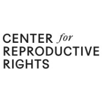

# CORA Chatbot – Capstone Project

**CORA** (Chatbot for Reproductive Access) is a bilingual virtual assistant developed to support users seeking information on reproductive rights, including abortion laws, self-managed abortion, and access to care. This project was developed as a final capstone for the MS in Management and Systems program at NYU SPS.

---

## 🌍 Project Overview

CORA was built using Microsoft Copilot Studio and is embedded in a custom HTML interface. The chatbot supports both English and Spanish and uses a static knowledge base made up of PDFs and links related to reproductive rights.

---

## 🛠 Tech Stack

- **Copilot Studio (Power Virtual Agents)**
- **HTML + CSS** front-end for web showcase
- **PDF and URL-based knowledge base**
- **No internet browsing or external APIs**
- **Languages:** English & Spanish

---

## 🧠 Core Features

- Smart fallback to keep conversations on-topic  
- Adaptive cards to guide users through key topics  
- Fixed logo and branded social media bar  
- Fully mobile responsive chatbot iframe  
- HTML chatbot showcase page  

---

## 🔗 Live Chatbot Demo

[CORA Chatbot (Web Embed)](https://copilotstudio.microsoft.com/environments/Default-7b331012-87a1-4a16-8b0f-a4605b1f3d7f/bots/cr52a_cora_qw9bL_/webchat?__version__=2)

---

## 🗂 File Structure

/assets                  → icons, logo, background  
/docs                   → assignments, PDF docs, demo scripts  
CORA_Chatbot_UI.html    → main chatbot showcase file  
README.md               → this file  

---

## 👩‍💻 Author

**Yasmin Marsh**  
M.S. Management & Systems — NYU SPS  
Developed in collaboration with the Center for Reproductive Rights  
[LinkedIn](https://www.linkedin.com/in/yasmin-marsh/)
